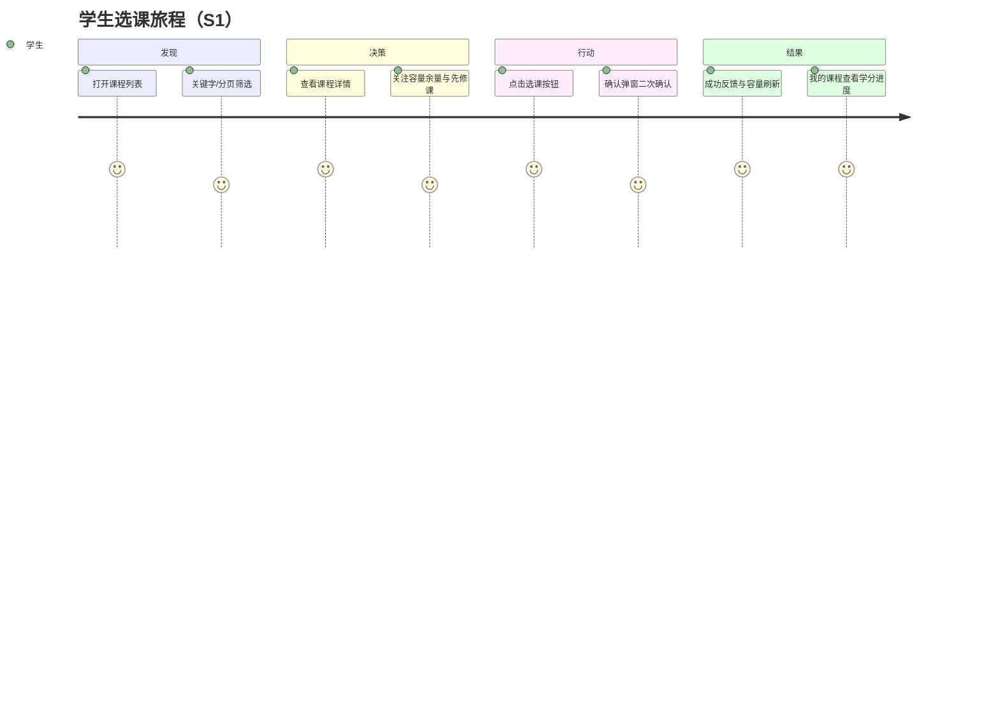
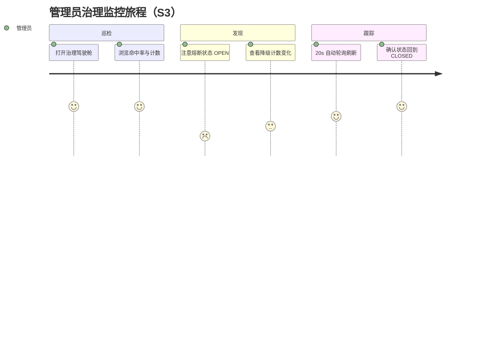
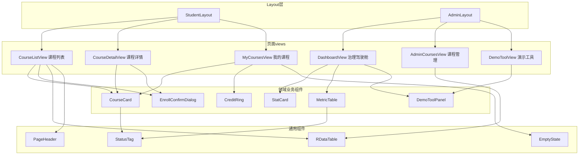
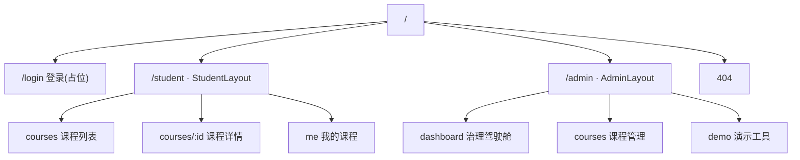
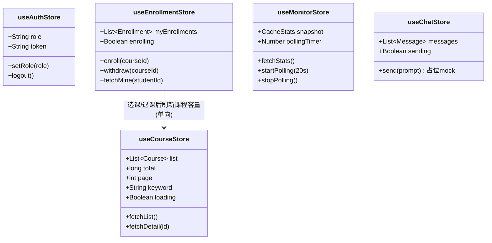
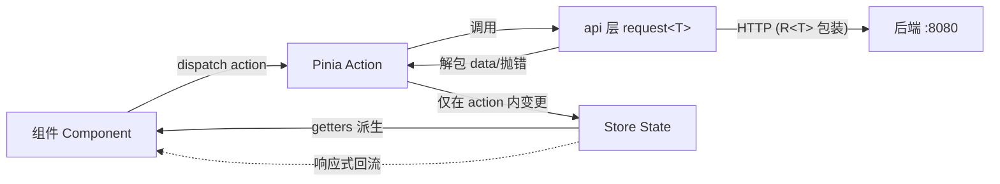

# 前端设计（hercules-ui）—— 场景驱动 / 组件复用 / 路由 / 单向数据流 + 领域分片状态

> **定位**：`hercules-ui/` 的设计基线。**状态：阶段 G 已落地**（2026-09-10），本文档为设计记录；
> 与实现的偏差：Vite 5→7、双 Layout 合并为单一 AppLayout（按角色渲染菜单）、登录/JWT/401 静默刷新/SSE 对话均已接真实后端（原"占位/mock"时点作废）、新增对话助手页 `/student/chat`（阶段 D 贯通）。
> **形态**：双端一壳 SPA——学生端与管理端按角色切换；布局：左侧可折叠功能菜单 + 顶部栏（标题 + 用户下拉）。
> **技术栈**：Vue 3.5 + Vite 7 + TypeScript + Pinia 3 + Vue Router 4 + Element Plus + ECharts。

---

## 一、设计原则

1. **场景驱动**：页面与组件从用户旅程（S1-S4）反推，不做无场景的功能；
2. **组件三级复用**：Layout → 领域业务组件 → 通用 UI 组件，业务组件必须标注「被哪些页面复用」；
3. **严格单向数据流**：Component →(dispatch)→ Store Action →(调用)→ api 层 → 后端 → Action 改 State → 响应式回流组件；组件**禁止**直接修改 store state；
4. **状态按领域分片**：Pinia store 与后端领域一一对应（课程/选课/监控/认证/对话），跨 store 依赖单向（enrollment → course）；
5. **API 层解包**：后端统一 `R<T>` 包装在 `src/api/` 层解掉，store 与组件只见业务数据与错误。

---

## 二、场景驱动的用户旅程

### S1 学生 · 浏览选课



### S3 管理员 · 治理监控



### 场景 × 页面 × 接口映射

| 场景 | 页面（路由） | 调用接口 |
| :--- | :--- | :--- |
| 登录（本期已可接真实接口） | `/login` | `POST /api/v1/auth/login`（→ accessToken/refreshToken 入 authStore） |
| S1 浏览选课 | `/student/courses`、`/student/courses/:id` | `GET /api/v1/courses`、`GET /api/v1/courses/{id}`、`POST /api/v1/enrollment`（body 仅 `{courseId}`，studentId 取自 token） |
| S2 退课/我的记录 | `/student/me` | `GET /api/v1/enrollment/mine`、`DELETE /api/v1/enrollment?courseId=` |
| S3 治理监控 | `/admin/dashboard` | `GET /api/v1/cache/stats`（20s 轮询，ADMIN 角色） |
| S4 答辩演示 | `/admin/demo` | `POST /api/v1/debug/simulate-conflict`、`POST /api/v1/debug/evict-local` |

> 认证已落地（《认证设计.md》）：所有请求经 `Authorization: Bearer <accessToken>`；
> 拦截器约定：401 → 用 refreshToken 静默刷新一次并重放，刷新失败跳 `/login`。

---

## 三、组件设计与复用

### 三层组件体系

| 层 | 职责 | 组件 |
| :--- | :--- | :--- |
| Layout | 角色级页面骨架（侧边导航 + 顶栏 + `<router-view>`） | `StudentLayout`、`AdminLayout` |
| 领域业务组件 | 绑定具体业务语义，跨页面复用 | `CourseCard`、`EnrollConfirmDialog`、`CreditRing`、`StatCard`、`MetricTable`、`DemoToolPanel` |
| 通用 UI 组件 | 与业务无关，跨领域复用 | `PageHeader`、`StatusTag`、`EmptyState`、`RDataTable` |

### 组件依赖与复用关系



### 复用矩阵

| 组件 | CourseListView | CourseDetailView | MyCoursesView | DashboardView | AdminCoursesView | DemoToolView |
| :--- | :---: | :---: | :---: | :---: | :---: | :---: |
| CourseCard | ✅ | ✅ | ✅ | — | — | — |
| EnrollConfirmDialog | ✅ | ✅ | — | — | — | — |
| CreditRing | — | — | ✅ | — | — | — |
| StatCard | — | — | — | ✅×6 | — | — |
| MetricTable | — | — | — | ✅ | ✅ | — |
| DemoToolPanel | — | — | — | — | — | ✅ |
| RDataTable | ✅ | — | — | — | ✅ | — |
| StatusTag | ✅(卡片) | ✅ | ✅ | — | ✅ | — |

**关键复用点**：
- `CourseCard` 一处实现三处复用：列表模式（含选课按钮）、详情模式（含先修课/时间片）、我的课程模式（含退课按钮）——由 `mode` prop 切换；
- `EnrollConfirmDialog` 由「列表卡片」与「详情页」共同触发，内部封装容量余量校验文案与 409（容量已满）错误展示；
- `StatCard` 驾驶舱六宫格复用（命中率/各级命中/dbLoad/versionApplied/conflict/熔断状态），差异仅图标与 tooltip。

---

## 四、路由结构（Vue Router 4）

### 路由表

| Path | 组件 | meta.roles | 说明 |
| :--- | :--- | :--- | :--- |
| `/login` | LoginView | 公开 | 登录页（占位：本地选择角色，阶段 H 接 JWT） |
| `/student` | StudentLayout | student | 学生端壳 |
| `/student/courses` | CourseListView | student | 课程列表（默认重定向目标） |
| `/student/courses/:id` | CourseDetailView | student | 课程详情 |
| `/student/me` | MyCoursesView | student | 我的课程 + 学分环 |
| `/admin` | AdminLayout | admin | 管理端壳 |
| `/admin/dashboard` | DashboardView | admin | 治理驾驶舱 |
| `/admin/courses` | AdminCoursesView | admin | 课程管理表格 |
| `/admin/demo` | DemoToolView | admin | 答辩演示工具 |
| `/:pathMatch(.*)*` | NotFoundView | 公开 | 404 |

### 路由树



**守卫约定**（`router.beforeEach`）：
1. 未登录（authStore 无角色）→ 一律重定向 `/login`；
2. 已登录但角色与 `meta.roles` 不符 → 重定向对应端首页；
3. 阶段 H 接 JWT 后：守卫改为校验 token 有效期 + 后端 401 全局登出，页面结构不变。

---

## 五、状态管理（Pinia · 按领域分片 + 单向数据流）

### Store 领域分片

| Store | 领域 | State（核心） | Actions |
| :--- | :--- | :--- | :--- |
| `useAuthStore` | 认证 | `role`、`token`(占位) | `setRole` / `logout` |
| `useCourseStore` | 课程 | `list`、`total`、`page`、`size`、`keyword`、`loading` | `fetchList`、`fetchDetail`、`setKeyword` |
| `useEnrollmentStore` | 选课 | `myEnrollments`、`enrolling` | `enroll`、`withdraw`、`fetchMine` |
| `useMonitorStore` | 监控 | `snapshot`、`pollingTimer` | `fetchStats`、`startPolling`、`stopPolling` |
| `useChatStore` | 对话 | `messages`、`sending` | `send`（阶段 D 前 mock） |



### 单向数据流



**单向数据流五条铁律**（代码评审依据）：
1. 组件只**读** state/getters，写操作一律 `store.action()`；
2. HTTP 调用只允许出现在 `src/api/*`，且只被 action 调用（组件禁止直连 api）；
3. `R<T>` 解包发生在 api 层：`code !== 0` 抛 `ApiError`，store 只处理业务数据；
4. 跨 store 依赖单向：`enrollment → course`（选课后刷新容量），禁止反向或环；
5. 组件本地 UI 状态（弹窗开关等）放组件内，不进 store。

---

## 六、API 层与目录结构

### api 层约定

- `src/api/course.ts / enrollment.ts / monitor.ts / auth.ts` 按领域分文件；
- 统一 `request<T>(config): Promise<T>`：axios 封装，负责解包 `R<T>`、401/409/404 错误映射（`ElMessage` 提示 + 抛 `ApiError`）、20s 超时；
- 类型集中在 `src/types/`（与后端字段一一对应：`Course`、`Enrollment`、`PageResult<T>`、`CacheStats`）。

### 目录树

```
hercules-ui/
├── vite.config.ts              # dev 代理 /api → http://127.0.0.1:8080
├── src/
│   ├── api/                    # 领域 API + request 封装
│   ├── stores/                 # Pinia 领域分片（5 个）
│   ├── router/                 # 路由表 + 守卫
│   ├── layouts/                # StudentLayout / AdminLayout
│   ├── components/
│   │   ├── business/           # 领域业务组件（可复用）
│   │   └── common/             # 通用 UI 组件
│   ├── views/
│   │   ├── student/            # 课程列表/详情/我的课程
│   │   ├── admin/              # 驾驶舱/课程管理/演示工具
│   │   └── LoginView.vue
│   ├── types/                  # 与后端契约对应的 TS 类型
│   └── main.ts
└── package.json
```

---

## 七、实施边界

| 范围 | 内容 | 时点 |
| :--- | :--- | :--- |
| 本期（✅ 已落地） | S1-S4 全部页面 + 对话助手（**阶段 D 已接 SSE 真实实现**，含候选卡确认按钮与停止生成） | 已完成 |
| 认证（✅ 已落地） | `/login` 接 JWT、守卫角色预判、401 单飞静默刷新、失效跳登录 | 已完成 |
| 后续可选 | 会话历史 Redis 持久化、移动端适配、Playwright E2E、暗色主题 | 未排期 |
