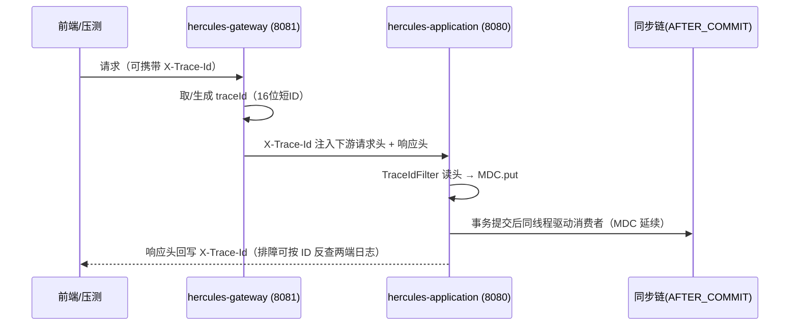

# 日志设计

> **定位**：hercules-platform 全模块的日志规范与实现说明（阶段 A+ 日志设计落地）。
> **框架**：SLF4J + Logback（Spring Boot 自带），**零新增依赖**。

---

## 一、日志格式与文件布局

统一 pattern（应用侧，含 traceId）：

```
%d{yyyy-MM-dd HH:mm:ss.SSS} %-5level [%X{traceId:-}] [%thread] %logger{36} - %msg%n
```

| Appender | 文件 | 滚动策略 | 保留 | 特性 |
| :--- | :--- | :--- | :--- | :--- |
| CONSOLE | — | — | — | UTF-8 显式声明（避免 Windows GBK 乱码） |
| APP_FILE | `logs/hercules-app.log` | 按天 + 100MB（SizeAndTimeBased） | 30 天 / 总量 2GB | 经 AsyncAppender（队列 4096、neverBlock）——压测高并发不阻塞业务线程 |
| AUTH_AUDIT_FILE | `logs/auth-audit.log` | 按天 | 90 天 | 认证审计专用（见 §三），同步写不丢失 |
| GATEWAY_FILE | `logs/hercules-gateway.log` | 按天 + 100MB | 30 天 / 1GB | 网关模块（WebFlux 无 MDC，traceId 在消息体内） |

容器内路径 `/app/logs`，compose 挂载 named volume（`hercules-app-logs` / `hercules-gateway-logs`）持久化；本机直跑时为工程工作目录下 `logs/`。

---

## 二、traceId 全链路贯通



- 缺失自动生成、上游携带自动复用；响应头回写，压测脚本可记录 traceId 定位失败请求；
- 阶段 F 接入 micrometer-tracing 后由 OTel traceId 接管，`TraceIdFilter` 退化为兜底；
- 网关侧（WebFlux/Reactor）无 MDC 线程绑定语义，traceId 以显式参数与消息内嵌方式记录。

---

## 三、认证审计（AUTH_AUDIT）

专用 logger（名为 `AUTH_AUDIT`，additivity=false，独立落盘 + 控制台双写），事件清单：

| 事件 | 级别 | 字段 | 触发点 |
| :--- | :--- | :--- | :--- |
| LOGIN_SUCCESS | INFO | username、ip、role、studentId | AuthController.login |
| LOGIN_FAILURE | WARN | username、ip、reason(BAD_CREDENTIALS/DISABLED) | AuthController.login（**不含密码**） |
| LOGOUT | INFO | username、ip、jti | AuthController.logout |
| LOGOUT_FAILED | WARN | username、ip、reason | 黑名单写入失败（fail-closed 返回 500 重试） |
| TOKEN_REJECTED_BLACKLIST | WARN | jti、path | JwtAuthenticationFilter（已登出 token 被重放） |

客户端 IP：网关注入 `X-Client-IP`（原始 remote addr），应用取头并回退 `getRemoteAddr()`。

---

## 四、级别与前缀约定

| 级别 | 使用场景 |
| :--- | :--- |
| ERROR | 需要人工介入的异常（同步链失败、未知异常——含堆栈） |
| WARN | 可自愈但需关注的异常（降级、熔断、锁等待超时、登录失败） |
| INFO | 关键业务节点（版本应用、审计事件、账号播种） |
| DEBUG | 键级留痕（缓存失效、过期版本丢弃），默认关闭 |

日志前缀约定（`[hercules-cache]` / `[hercules-sync]` / `[hercules-auth]` / `[hercules-gateway]`），便于 `grep` 快速过滤。

---

## 五、敏感信息规范（红线）

1. **密码**：任何形式（明文/密文）不落日志——BCrypt 比对失败只记用户名与 IP；
2. **Token**：accessToken/refreshToken/JWT 原文不落日志（jti 与 username 可记）；
3. **secret**：`hercules.auth.secret` 等配置项不落日志；
4. **SQL 参数**：不开启 MyBatis 全参数 DEBUG（生产/压测期）；
5. 用户可读数据（课程名等）不受限，但审计行保持结构化（`字段=值`），避免自由拼接。

---

## 六、压测与容器注意

- AsyncAppender `neverBlock=true`：队列满时丢弃并计数（保吞吐优先），日志量异常增长时以 Grafana/容器资源观测配合；
- 容器 stdout 由 docker 收集（`docker logs`），落盘文件经 volume 持久化，双通道互备；
- 排查动线：响应头 `X-Trace-Id` → `grep <traceId> hercules-app.log`（应用全链路）→ `grep <traceId> hercules-gateway.log`（入口层）。
