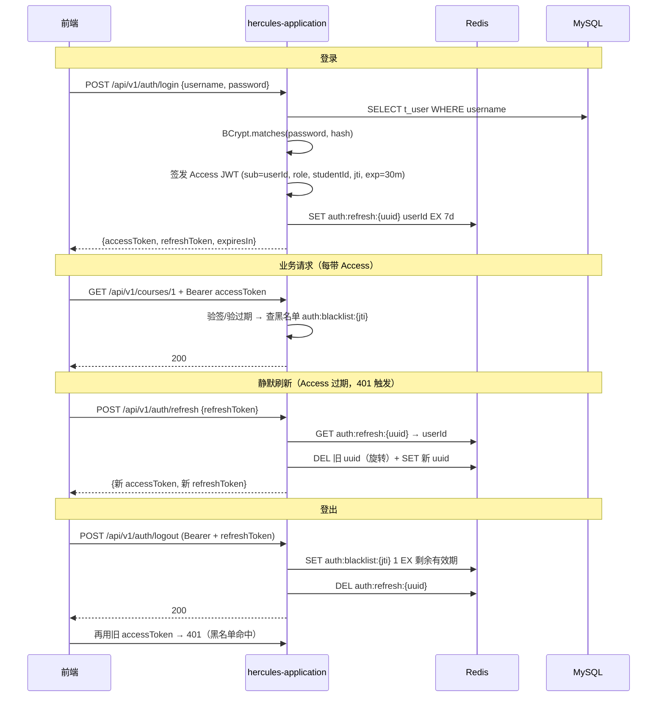
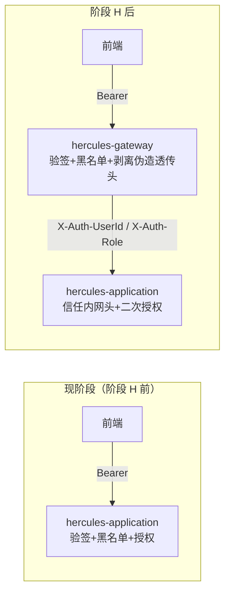

# 认证设计（双 Token + 应用内鉴权先行）

> **定位**：阶段 H 之前认证在本应用内实现；网关落地后验签/黑名单迁移至 Gateway，应用内降级为「信任透传头 + 二次授权」。
> **角色**：`STUDENT`（学生）/ `ADMIN`（管理/运维）。运维人员不再单设角色，走 admin。

---

## 一、双 Token 机制

| Token | 形态 | 有效期 | 存放 | 用途 |
| :--- | :--- | :--- | :--- | :--- |
| Access Token | JWT（HS256，jjwt 0.13.0） | **30 分钟** | 前端 Pinia 内存（不落 localStorage） | 业务接口 `Authorization: Bearer` |
| Refresh Token | UUID（无业务语义） | **7 天** | 服务端 Redis：`auth:refresh:{uuid}` → userId | 换新 Token 对（**旋转式**：换新即删旧） |

- Access 短时泄露风险可控（30min 自动过期）；
- Refresh 存服务端 → 可随时强制失效（管理员踢人/用户改密场景）；
- **旋转式刷新**：refresh 一次即作废旧值，降低重放窗口。

### 时序图



### Redis 键设计

| 键 | Value | TTL | 写入时机 |
| :--- | :--- | :--- | :--- |
| `auth:refresh:{uuid}` | userId | 7d | 登录 / 刷新（旋转时删旧立新） |
| `auth:blacklist:{jti}` | `1` | = Access 剩余有效期 | 登出 |

---

## 二、JWT 规范

- 密钥：`hercules.auth.secret`（`application-local.yml`，gitignore），HMAC-SHA256 要求 ≥ 256 位（64 字符随机串）；
- Payload：`sub`=userId、`username`、`role`、`studentId`（admin 为 null）、`jti`、`iat`、`exp`。**禁止**存密码/手机号等敏感字段；
- 前端不解析信任 payload 的权限语义，权限以后端二次校验为准；
- 体积：payload 仅 4 个业务字段，远小于 8KB 上限。

---

## 三、用户表（新增，起步文档设计增补）

```sql
CREATE TABLE IF NOT EXISTS t_user (
    id          BIGINT PRIMARY KEY AUTO_INCREMENT,
    username    VARCHAR(50)  NOT NULL,
    password    VARCHAR(60)  NOT NULL,          -- BCrypt（强度 10）
    role        VARCHAR(20)  NOT NULL,          -- STUDENT / ADMIN
    student_id  BIGINT,                         -- 学生业务号（选课用）；管理员为 NULL
    status      TINYINT      NOT NULL DEFAULT 1,-- 1 启用 0 停用
    create_time DATETIME(3)  NOT NULL,
    CONSTRAINT uk_user_username UNIQUE (username)
);
```

种子账号由 `AuthUserSeeder` 应用启动器**幂等写入**（BCrypt 密文启动时现场生成，避免静态弱密文）：`admin/admin123`（ADMIN）、`st001~st003/123456`（STUDENT，student_id=20240001~03）。

### 接口契约变更（水平越权收敛）

| 接口 | 变更前 | 变更后 |
| :--- | :--- | :--- |
| `POST /api/v1/enrollment` | body `{studentId, courseId}`（信任前端） | body `{courseId}`；studentId 取自 token（仅 STUDENT 角色） |
| `DELETE /api/v1/enrollment` | query `studentId&courseId` | query `courseId`；studentId 取自 token |
| `GET /api/v1/enrollment/mine` | — | **新增**：查本人选课记录（S2 页面数据源） |

> 越权场景关闭：学生 A 无法操作学生 B 的数据（studentId 服务端说了算）。

---

## 四、应用内鉴权（阶段 H 前的形态）

- Spring Security `SecurityFilterChain`：无状态、CSRF 关闭；
- 白名单（permitAll）：`/api/v1/auth/login`、`/api/v1/auth/refresh`、`/actuator/health`、`/actuator/prometheus`；
- `JwtAuthenticationFilter`（OncePerRequestFilter）：解析 Bearer → 验签/过期 → 查黑名单 → 写 SecurityContext（userId/role/studentId）；
- URL 角色规则：`/api/v1/enrollment/**` → STUDENT；`/api/v1/cache/stats`、`/api/v1/debug/**` → ADMIN；`/api/v1/courses/**` → 认证即可；其余 `denyAll`；
- 401/403 统一返回 `R.fail` JSON（`JsonUtil` 序列化）。

**Redis 故障策略（阶段 A+ 熔断模式的延续）**：

| 依赖 | 故障时行为 | 理由 |
| :--- | :--- | :--- |
| 黑名单查询 | 短超时 + **放行** + 计数告警（fail-open） | 黑名单只影响「登出后的 token 被重放」这一低危场景，可用性优先 |
| Refresh 校验/写入 | **fail-closed**：直接 401/500，提示重试或重新登录 | 刷新失败只影响续期，重新登录即可，不牺牲安全性 |
| 登出写黑名单失败 | 返回 500 让用户重试（不允许「登出失败但 token 继续有效」） | 安全性优先 |

---

## 五、两阶段迁移（网关落地时）



迁移要点：
1. Gateway 全局过滤器接管：验签、过期、黑名单、白名单；校验通过后注入 `X-Auth-UserId` / `X-Auth-Role` 透传头，并**剥离客户端伪造的同名头**（先 remove 后 inject，防越权经典漏洞）；
2. 应用内 `JwtAuthenticationFilter` 替换为「透传头 → SecurityContext」的轻量过滤器，并对**非网关来源**的请求拒绝（网关→应用加共享密钥头校验）；
3. `JwtUtil` 下沉 hercules-common，网关与应用共用（签发仍只在登录接口）。

---

## 六、前端衔接（见《前端设计.md》）

- axios 请求拦截器：attach Access；
- 响应拦截器：401 → 用 refreshToken 静默刷新一次 → 重放原请求；刷新也失效 → 跳 `/login`；
- `authStore`：`accessToken` 只存内存，`refreshToken` 存内存（毕设不引 localStorage，关标签即失效，安全演示友好）；
- 接口契约变更同步：enroll 请求体收敛为 `{courseId}`，studentId 服务端自取。
