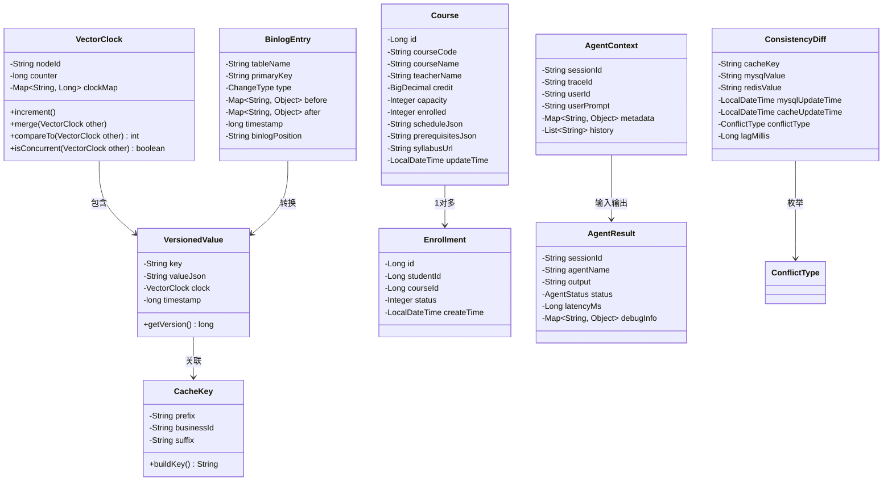
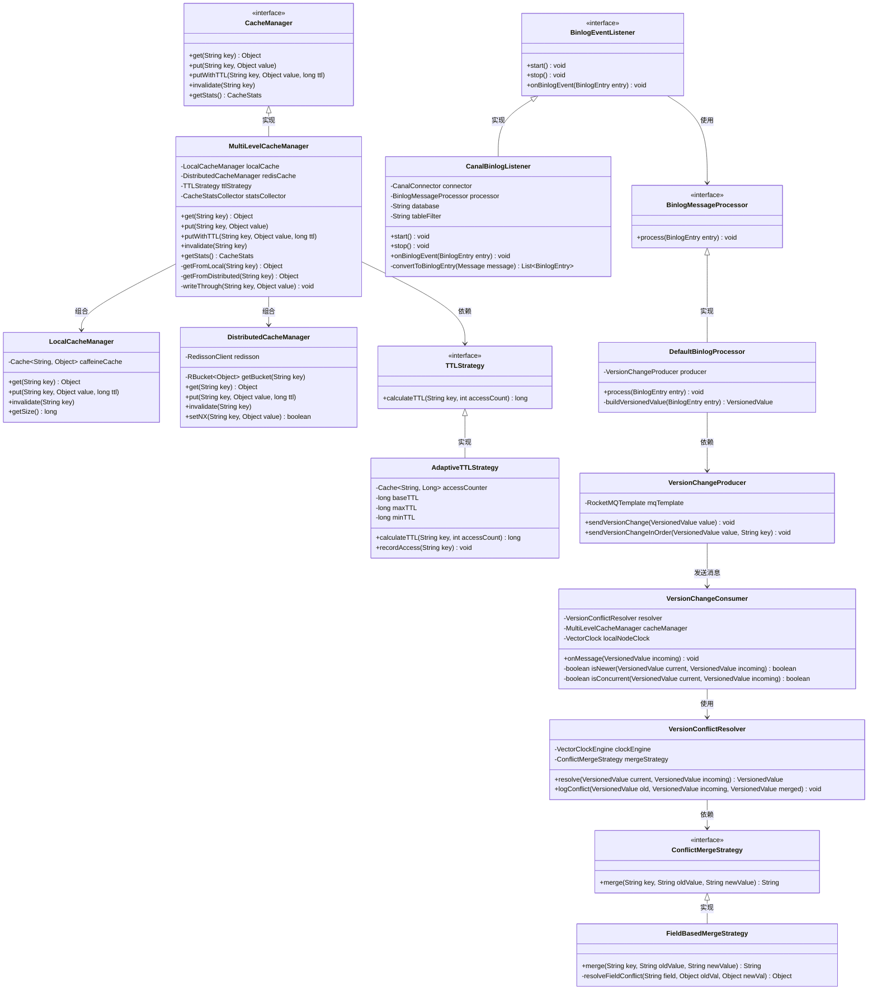
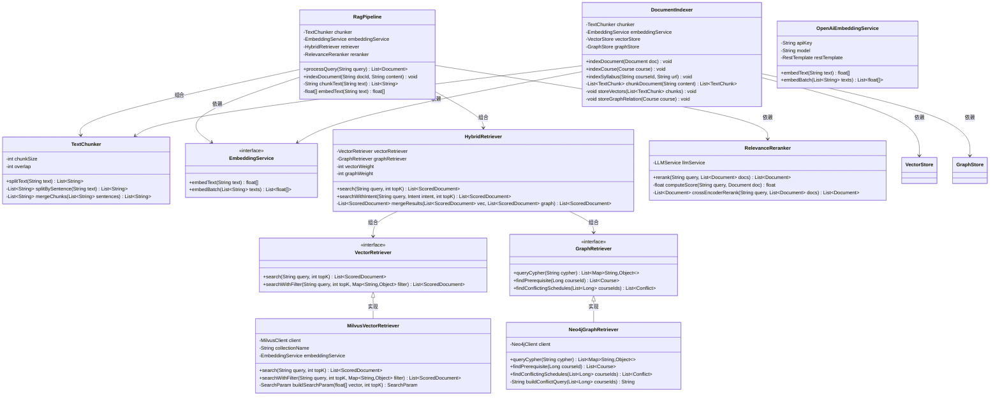
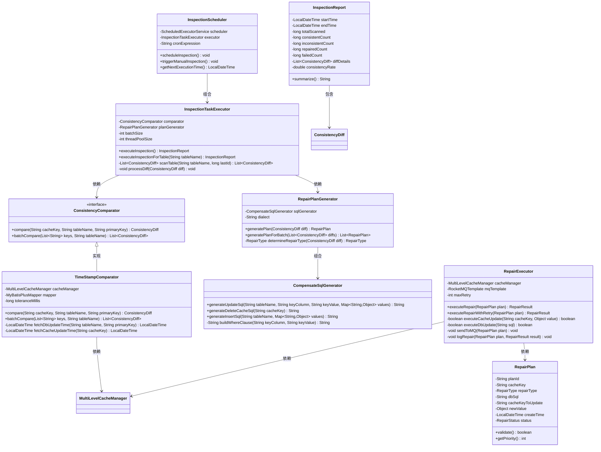

这份文件是开工时画的设计稿，之后没有跟着代码同步更新，所以和实际代码有出入。
实际结构以[包结构说明.md](包结构说明.md)为准，每条需求做到哪一步见[路线图.md](路线图.md)。

本文从 Java 类的角度记录项目结构，用 Mermaid 类图和包结构树两种方式表示领域模型、接口和类间关系。

hercules-inspector、hercules-rag、hercules-observability、hercules-admin 四个模块内无代码，其中的类只有设计稿，下文逐处标注。

已知的主要差异：

- 包名：本文写的是 `com/hercules`，代码里是 `com/zhanjh/hercules`。
- 缓存：本文画的是 Canal + Redisson + RocketMQ，代码里没有 Redisson，二级缓存是 `RedisDistributedCacheManager`，Binlog 侧是 `RocketMQBinlogListener`，本机模式用 `InProcessEventBusProducer`。
- 智能体：本文列的 `BaseAgent`、`AgentRegistry`、`AgentFactory`、`AgentSession`、`ExecutionPlan`、`IntentRouter`、`CollaborationEngine` 在代码里不存在，实际只有 `AgentOrchestrator` 加四个智能体。
- 智能体框架：本文写的是 Spring AI Alibaba，代码里用的是 Spring AI。

---

# 智慧校园多智能体服务平台 —— Java类架构设计（UML视角）

## 一、整体包结构树

```
hercules-platform/
│
├── hercules-common/                              # 公共基础模块
│   └── src/main/java/com/hercules/common/
│       ├── model/                                # 领域模型层
│       │   ├── clock/VectorClock.java
│       │   ├── clock/VersionedValue.java
│       │   ├── cache/CacheKey.java
│       │   ├── sync/BinlogEntry.java
│       │   ├── sync/ChangeType.java
│       │   ├── agent/AgentContext.java
│       │   ├── agent/AgentResult.java
│       │   ├── enrollment/Course.java
│       │   ├── enrollment/Student.java
│       │   ├── enrollment/Enrollment.java
│       │   └── inspection/ConsistencyDiff.java
│       ├── constant/
│       │   ├── CacheConstants.java
│       │   ├── MQTopicConstants.java
│       │   └── SystemConstants.java
│       ├── enums/
│       │   ├── ConflictType.java
│       │   ├── RepairStatus.java
│       │   └── AgentType.java
│       ├── exception/
│       │   ├── BusinessException.java
│       │   ├── CacheException.java
│       │   └── AgentExecutionException.java
│       └── util/
│           ├── JsonUtil.java
│           └── HashUtil.java
│
├── hercules-cache/                               # 缓存治理模块
│   └── src/main/java/com/hercules/cache/
│       ├── core/
│       │   ├── CacheManager.java                 # 门面接口
│       │   ├── MultiLevelCacheManager.java       # 多级缓存实现
│       │   ├── LocalCacheManager.java            # Caffeine封装
│       │   └── DistributedCacheManager.java      # Redis封装
│       ├── strategy/
│       │   ├── TTLStrategy.java                  # TTL策略接口
│       │   ├── AdaptiveTTLStrategy.java          # 自适应TTL
│       │   ├── FixedTTLStrategy.java             # 固定TTL
│       │   └── EvictionStrategy.java             # 淘汰策略
│       ├── stats/
│       │   ├── CacheStatsCollector.java
│       │   └── CacheHitRateCalculator.java
│       └── config/
│           ├── CaffeineConfig.java
│           └── RedisConfig.java
│
├── hercules-sync/                                # 数据同步模块
│   └── src/main/java/com/hercules/sync/
│       ├── listener/
│       │   ├── BinlogEventListener.java          # 监听器接口
│       │   └── CanalBinlogListener.java          # Canal实现
│       ├── producer/
│       │   ├── VersionChangeProducer.java        # 版本变更生产者
│       │   └── RepairTaskProducer.java           # 修复任务生产者
│       ├── consumer/
│       │   ├── VersionChangeConsumer.java        # 版本变更消费者
│       │   ├── RepairTaskConsumer.java           # 修复任务消费者
│       │   └── VersionConflictResolver.java      # 向量时钟冲突消解器
│       ├── processor/
│       │   ├── BinlogMessageProcessor.java       # Binlog消息处理器接口
│       │   └── DefaultBinlogProcessor.java
│       └── convert/
│           ├── BinlogToVersionConverter.java
│           └── MySQLTypeMapper.java
│
├── hercules-inspector/                           # 巡检与自愈模块（未实现：模块内无代码）
│   └── src/main/java/com/hercules/inspector/
│       ├── scheduler/
│       │   ├── InspectionScheduler.java          # 定时调度器
│       │   └── InspectionTaskExecutor.java       # 任务执行器
│       ├── comparator/
│       │   ├── ConsistencyComparator.java        # 一致性比对器接口
│       │   └── TimeStampComparator.java          # 基于时间戳比对
│       ├── repair/
│       │   ├── RepairPlanGenerator.java          # 修复方案生成器
│       │   ├── CompensateSqlGenerator.java       # 补偿SQL生成器
│       │   └── RepairExecutor.java               # 修复执行器
│       └── model/
│           ├── InspectionTask.java
│           └── RepairPlan.java
│
├── hercules-agent/                               # 多智能体决策模块
│   └── src/main/java/com/hercules/agent/
│       ├── orchestrator/
│       │   ├── AgentOrchestrator.java            # 总调度器
│       │   ├── AgentRegistry.java                # 智能体注册表（未实现，四个智能体写死在编排器里）
│       │   ├── IntentRouter.java                 # 意图路由器（未实现，实际由 RoutingAgent 承担）
│       │   └── CollaborationEngine.java           # 协作引擎（未实现，实际由编排器按顺序调用）
│       ├── core/
│       │   ├── BaseAgent.java                    # 智能体抽象基类（未实现）
│       │   ├── RoutingAgent.java                 # 路由智能体
│       │   ├── RecommendationAgent.java          # 课程推荐智能体
│       │   ├── SchedulingAgent.java              # 排课冲突智能体
│       │   └── ExecutionAgent.java               # 执行智能体
│       ├── context/
│       │   ├── AgentSession.java                 # 会话上下文（未实现，实际用 AgentContext 加 ConversationHistory）
│       │   ├── ConversationHistory.java          # 对话历史
│       │   └── ExecutionPlan.java                # 执行计划（未实现）
│       ├── factory/
│       │   └── AgentFactory.java                 # 智能体工厂（未实现，由 Spring 构造注入）
│       └── config/
│           └── SpringAIConfig.java               # Spring AI 配置
│
├── hercules-rag/                                 # RAG检索增强模块（未实现：模块内无代码）
│   └── src/main/java/com/hercules/rag/
│       ├── indexer/
│       │   ├── DocumentIndexer.java              # 文档索引器
│       │   ├── TextChunker.java                  # 文本分块器
│       │   └── EmbeddingService.java             # 向量化服务
│       ├── retriever/
│       │   ├── VectorRetriever.java              # 向量检索器
│       │   ├── GraphRetriever.java               # 图检索器（Neo4j）
│       │   └── HybridRetriever.java              # 混合检索器
│       ├── rerank/
│       │   └── RelevanceReranker.java            # 相关性重排序
│       ├── store/
│       │   ├── VectorStore.java                  # 向量存储接口
│       │   ├── MilvusVectorStore.java            # Milvus实现
│       │   └── GraphStore.java                   # 图存储接口（Neo4j）
│       └── pipeline/
│           └── RagPipeline.java                  # RAG流水线编排
│
├── hercules-gateway/                             # API网关模块
│   └── src/main/java/com/hercules/gateway/
│       ├── filter/
│       │   ├── AuthenticationFilter.java
│       │   ├── RateLimitFilter.java
│       │   ├── TraceIdFilter.java
│       │   └── LoggingFilter.java
│       ├── controller/
│       │   ├── ChatController.java               # 对话接口
│       │   ├── CourseController.java             # 课程接口
│       │   ├── EnrollmentController.java         # 选课接口
│       │   └── DashboardController.java          # 大盘接口
│       └── handler/
│           └── GlobalExceptionHandler.java
│
├── hercules-observability/                       # 可观测性模块（未实现：模块内无代码）
│   └── src/main/java/com/hercules/observability/
│       ├── opentelemetry/
│       │   ├── OtelConfiguration.java            # OTel配置
│       │   ├── SpanCustomizer.java               # Span定制器
│       │   └── TraceContextPropagator.java       # 上下文传播
│       ├── metric/
│       │   ├── MetricRegistry.java               # 指标注册
│       │   ├── CacheMetricBinder.java            # 缓存指标绑定
│       │   └── AgentMetricBinder.java            # 智能体指标绑定
│       ├── health/
│       │   ├── ConsistencyHealthIndicator.java   # 一致性健康指示器
│       │   └── HealthScoreCalculator.java        # 健康度计算
│       └── exporter/
│           └── PrometheusExporterConfig.java
│
├── hercules-admin/                               # 管控台后端（未实现：模块内无代码）
│   └── src/main/java/com/hercules/admin/
│       ├── controller/
│       │   ├── DashboardController.java
│       │   ├── ConfigController.java
│       │   └── LogController.java
│       └── service/
│           ├── DashboardService.java
│           └── ConfigService.java
│
└── hercules-application/                         # 应用启动模块
    └── src/main/java/com/hercules/
        └── HerculesApplication.java               # Spring Boot启动类
```


## 二、核心领域模型类图（DTO/Entity）



### 枚举定义

| 枚举名 | 常量值 |
| :--- | :--- |
| `ChangeType` | INSERT, UPDATE, DELETE |
| `ConflictType` | VERSION_CONFLICT, DATA_LOST, DATA_MISMATCH, NONE |
| `RepairStatus` | PENDING, AUTO_FIXED, MANUAL_REQUIRED, FAILED |
| `AgentType` | ROUTING, RECOMMENDATION, SCHEDULING, EXECUTION |
| `AgentStatus` | SUCCESS, FAILED, TIMEOUT, PENDING |


## 三、缓存一致性治理层类图（Hercules核心）

图中的 VectorClock（向量时钟）记录每个节点各自把数据改到第几版，用来判断两条更新谁新、还是同时发生。binlog 是 MySQL 的变更日志，Canal 把它读出来转成版本消息，消费端据此更新缓存。




## 四、多智能体决策层类图

AgentRegistry 的动态注册未实现：四个智能体（Routing、Recommendation、Scheduling、Execution）写死在编排器里。

```mermaid
classDiagram
    %% 智能体基类
    class BaseAgent {
        <<abstract>>
        -String agentName
        -AgentType agentType
        -int priority
        -boolean enabled
        +execute(AgentContext context) AgentResult
        +validate(AgentContext context) boolean*
        +supports(AgentContext context) boolean*
        -logExecution(AgentContext context, AgentResult result) void
    }
    
    class RoutingAgent {
        -IntentClassifier classifier
        -AgentRegistry registry
        -CollaborationEngine engine
        +supports(AgentContext context) boolean
        +validate(AgentContext context) boolean
        +execute(AgentContext context) AgentResult
        -Intent classifyIntent(String prompt) Intent
        -List~AgentType~ selectAgents(Intent intent) List~AgentType~
        -AgentResult orchestrate(AgentContext context, List~AgentType~ selected) AgentResult
    }
    
    class RecommendationAgent {
        -HybridRetriever retriever
        -LLMService llmService
        -String systemPrompt
        +supports(AgentContext context) boolean
        +validate(AgentContext context) boolean
        +execute(AgentContext context) AgentResult
        -List~Course~ retrieveCourses(String query) List~Course~
        -String generateRecommendation(List~Course~ courses, String query) String
    }
    
    class SchedulingAgent {
        -GraphStore graphStore
        -ConstraintValidator validator
        +supports(AgentContext context) boolean
        +validate(AgentContext context) boolean
        +execute(AgentContext context) AgentResult
        -List~Course~ checkTimeConflicts(List~Long~ courseIds, Long studentId) List~Course~
        -List~Course~ checkPrerequisite(Long courseId, Long studentId) List~Course~
        -boolean checkCreditLimit(Long studentId, List~Long~ courseIds) boolean
    }
    
    class ExecutionAgent {
        -EnrollmentService enrollmentService
        -DistributedLock lockService
        +supports(AgentContext context) boolean
        +validate(AgentContext context) boolean
        +execute(AgentContext context) AgentResult
        -boolean acquireLock(Long courseId, Long studentId) boolean
        -Enrollment executeEnrollment(Long studentId, Long courseId) Enrollment
        -void releaseLock(Long courseId, Long studentId) void
    }
    
    %% 编排与协作
    class AgentOrchestrator {
        -AgentRegistry registry
        -IntentRouter router
        -CollaborationEngine collaborationEngine
        -AgentTracer tracer
        +process(AgentContext context) AgentResult
        -AgentResult routeAndExecute(AgentContext context) AgentResult
        -AgentResult executeSequential(List~AgentType~ chain, AgentContext context) AgentResult
        -AgentResult executeParallel(List~AgentType~ agents, AgentContext context) List~AgentResult~
    }
    
    class AgentRegistry {
        -Map~AgentType, BaseAgent~ agentMap
        +register(AgentType type, BaseAgent agent) void
        +get(AgentType type) BaseAgent
        +listAll() List~BaseAgent~
        +listEnabled() List~BaseAgent~
    }
    
    class IntentRouter {
        -Map~String, AgentType~ ruleMap
        -IntentClassifier classifier
        +route(AgentContext context) List~AgentType~
        -AgentType classifyByKeyword(String prompt) AgentType
        -AgentType classifyByLLM(String prompt) AgentType
    }
    
    class CollaborationEngine {
        -ExecutionPlanBuilder planBuilder
        -ResultAggregator aggregator
        +buildPlan(List~AgentType~ agents, AgentContext context) ExecutionPlan
        +executePlan(ExecutionPlan plan) AgentResult
        +aggregateResults(List~AgentResult~ results) AgentResult
    }
    
    class AgentSession {
        -String sessionId
        -String userId
        -ConversationHistory history
        -Map~String, Object~ variables
        +addTurn(String prompt, String response) void
        +getVariable(String key) Object
        +setVariable(String key, Object value) void
    }
    
    BaseAgent <|-- RoutingAgent : 继承
    BaseAgent <|-- RecommendationAgent : 继承
    BaseAgent <|-- SchedulingAgent : 继承
    BaseAgent <|-- ExecutionAgent : 继承
    
    RoutingAgent --> AgentRegistry : 依赖
    RoutingAgent --> CollaborationEngine : 依赖
    
    AgentOrchestrator --> AgentRegistry : 组合
    AgentOrchestrator --> IntentRouter : 组合
    AgentOrchestrator --> CollaborationEngine : 组合
    
    CollaborationEngine --> AgentSession : 使用
    AgentSession --> ConversationHistory : 包含
```




## 五、RAG检索层类图

本节类均未实现：hercules-rag 模块内无代码。RAG 指先检索文档，再把检索结果交给模型生成回答。




## 六、巡检与自愈引擎类图

本节类均未实现：hercules-inspector 模块内无代码。




## 七、可观测性模块类图

本节类均未实现：hercules-observability 模块内无代码。分布式链路追踪未实现；指标采集实际用 Micrometer 手工埋点。一致性健康度评分也未实现。

```mermaid
classDiagram
    class OtelConfiguration {
        -String serviceName
        -String endpoint
        -double samplingRate
        +initOpenTelemetry() OpenTelemetry
        +initTracer() Tracer
        +initMeter() Meter
        -Resource createResource() Resource
        -SpanProcessor createSpanProcessor() SpanProcessor
    }
    
    class SpanCustomizer {
        -Tracer tracer
        -Span currentSpan
        +addAttribute(String key, String value) void
        +addAttribute(String key, long value) void
        +addEvent(String name) void
        +addEvent(String name, Map~String,Object~ attributes) void
        +setStatusOk() void
        +setStatusError(String description) void
        +recordException(Throwable t) void
    }
    
    class TraceContextPropagator {
        -TextMapPropagator propagator
        +extractContext(Map~String,String~ headers) Context
        +injectContext(Context context, Map~String,String~ headers) void
        +getTraceId() String
        +getSpanId() String
    }
    
    class MetricRegistry {
        -Meter meter
        -Map~String, DoubleGauge~ gauges
        -Map~String, Counter~ counters
        -Map~String, Histogram~ histograms
        +registerCounter(String name, String description) Counter
        +registerGauge(String name, String description) DoubleGauge
        +registerHistogram(String name, String description, List~double~ buckets) Histogram
        +getCounter(String name) Counter
        +getHistogram(String name) Histogram
    }
    
    class CacheMetricBinder {
        -MultiLevelCacheManager cacheManager
        -MetricRegistry registry
        +bindCacheHitRate() void
        +bindCacheSize() void
        +bindCacheGetLatency() void
        -void updateHitRate() void
        -void updateSize() void
    }
    
    class AgentMetricBinder {
        -AgentOrchestrator orchestrator
        -MetricRegistry registry
        +bindAgentInvokeCount() void
        +bindAgentLatency() void
        +bindAgentSuccessRate() void
        -void updateAgentMetrics() void
    }
    
    class ConsistencyHealthIndicator {
        -ConsistencyInspector inspector
        -HealthScoreCalculator calculator
        +health() Health
        -double calculateScore() double
        -String getStatus(double score) String
        -Map~String,Object~ buildDetails() Map~String,Object~
    }
    
    class HealthScoreCalculator {
        -double cacheHitRateWeight
        -double consistencyRateWeight
        -double repairSuccessRateWeight
        -double latencyWeight
        +calculate(HealthMetrics metrics) double
        -double normalizeMetric(double value, double min, double max) double
    }
    
    class HealthMetrics {
        -double cacheHitRate
        -double consistencyRate
        -double repairSuccessRate
        -double avgLatency
        -long totalRequests
        -long errorCount
        +getScore() double
    }
    
    OtelConfiguration --> SpanCustomizer : 创建
    OtelConfiguration --> TraceContextPropagator : 创建
    OtelConfiguration --> MetricRegistry : 创建
    
    CacheMetricBinder --> MetricRegistry : 依赖
    CacheMetricBinder --> MultiLevelCacheManager : 依赖
    AgentMetricBinder --> MetricRegistry : 依赖
    AgentMetricBinder --> AgentOrchestrator : 依赖
    
    ConsistencyHealthIndicator --> HealthScoreCalculator : 组合
    ConsistencyHealthIndicator --> HealthMetrics : 使用
```




## 八、API网关层（Controller）类图

```mermaid
classDiagram
    class ChatController {
        -AgentOrchestrator orchestrator
        -AgentSessionManager sessionManager
        +chat(String sessionId, String prompt, String userId) ResponseEntity~ChatResponse~
        +streamChat(String sessionId, String prompt, String userId) Flux~ChatChunk~
        +getHistory(String sessionId) ResponseEntity~List~ChatTurn~~
        +clearSession(String sessionId) ResponseEntity~Void~
    }
    
    class CourseController {
        -CourseService courseService
        -MultiLevelCacheManager cacheManager
        +listCourses(CourseQuery query) ResponseEntity~PageResult~Course~~
        +getCourse(Long id) ResponseEntity~Course~
        +searchCourses(String keyword) ResponseEntity~List~Course~~
        +getStatistics() ResponseEntity~CourseStats~
    }
    
    class EnrollmentController {
        -EnrollmentService enrollmentService
        -DistributedLock lockService
        -VersionChangeProducer producer
        +enroll(Long studentId, Long courseId) ResponseEntity~EnrollmentResult~
        +withdraw(Long studentId, Long courseId) ResponseEntity~EnrollmentResult~
        +getMyCourses(Long studentId) ResponseEntity~List~Enrollment~~
        +checkConflict(Long studentId, Long courseId) ResponseEntity~ConflictCheckResult~
    }
    
    class DashboardController {
        -ConsistencyHealthIndicator healthIndicator
        -CacheStatsCollector statsCollector
        -MetricRegistry metricRegistry
        +getHealth() ResponseEntity~Health~
        +getCacheStats() ResponseEntity~CacheStatsVO~
        +getConsistencyStats() ResponseEntity~ConsistencyStatsVO~
        +getAgentStats() ResponseEntity~AgentStatsVO~
        +getFullDashboard() ResponseEntity~DashboardVO~
    }
    
    class ChatResponse {
        -String sessionId
        -String message
        -List~String~ agentChain
        -long latencyMs
        -String traceId
    }
    
    class ChatChunk {
        -String sessionId
        -String content
        -boolean isEnd
    }
    
    class EnrollmentResult {
        -boolean success
        -String message
        -Enrollment enrollment
        -String traceId
        -List~String~ conflicts
    }
    
    ChatController --> AgentOrchestrator : 依赖
    CourseController --> MultiLevelCacheManager : 依赖
    EnrollmentController --> VersionChangeProducer : 依赖
    DashboardController --> ConsistencyHealthIndicator : 依赖
    DashboardController --> CacheStatsCollector : 依赖
```




## 九、类关系总览（核心依赖矩阵）

| 来源模块 | 目标模块 | 依赖关系 | 原因 |
| :--- | :--- | :--- | :--- |
| `hercules-agent` | `hercules-common` | 编译依赖 | 用 AgentContext、AgentResult 等模型 |
| `hercules-agent` | `hercules-cache` | 编译依赖 | 智能体读数据走多级缓存 |
| `hercules-agent` | `hercules-rag` | 编译依赖 | 推荐智能体需要 RAG 检索（未实现：模块内无代码） |
| `hercules-sync` | `hercules-common` | 编译依赖 | 用 BinlogEntry、VectorClock 等模型 |
| `hercules-sync` | `hercules-cache` | 运行时依赖 | 同步结果写入 Redis 缓存 |
| `hercules-inspector` | `hercules-common` | 编译依赖 | 用 ConsistencyDiff 等模型（未实现：模块内无代码） |
| `hercules-inspector` | `hercules-cache` | 运行时依赖 | 巡检读 Redis 比对（未实现：模块内无代码） |
| `hercules-inspector` | `hercules-sync` | 运行时依赖 | 修复任务通过 RocketMQ 发送（未实现：模块内无代码） |
| `hercules-gateway` | `hercules-agent` | 编译依赖 | Controller 调用 AgentOrchestrator |
| `hercules-gateway` | `hercules-cache` | 编译依赖 | 课程查询走缓存 |
| `hercules-admin` | `hercules-observability` | 编译依赖 | 管控台展示健康度指标（未实现：模块内无代码） |
| `hercules-application` | 所有模块 | 运行时依赖 | Spring Boot 启动类组合所有模块 |


## 十、设计模式应用总结

| 设计模式 | 应用场景 | 核心类 |
| :--- | :--- | :--- |
| 门面模式 | 多级缓存统一入口 | `MultiLevelCacheManager` |
| 策略模式 | TTL 计算、冲突合并 | `TTLStrategy`, `ConflictMergeStrategy` |
| 模板方法 | 巡检执行流程 | `InspectionTaskExecutor`（定义`scanTable` → `compare` → `repair`骨架；未实现：模块内无代码） |
| 工厂模式 | 智能体实例创建 | `AgentFactory`（未实现，由 Spring 构造注入） |
| 注册表模式 | 智能体注册与查找 | `AgentRegistry`（未实现：四个智能体写死在编排器里） |
| 责任链模式 | 网关过滤器链 | `AuthenticationFilter` → `RateLimitFilter` → `TraceIdFilter` |
| 观察者模式 | Canal Binlog 事件监听 | `BinlogEventListener` → `BinlogMessageProcessor` |
| 代理模式 | Span 增强 | `SpanCustomizer` 包装 OpenTelemetry Span（未实现：链路追踪未实现） |
| 建造者模式 | 复杂对象构建 | `AgentContext.Builder`, `RepairPlan.Builder` |


本文记录设计阶段的类结构和依赖关系。四个模块内无代码，图中相关类只是设计稿；实际实现与图中不一致时以代码为准。需要展开某个类的完整字段或方法签名时再补充。