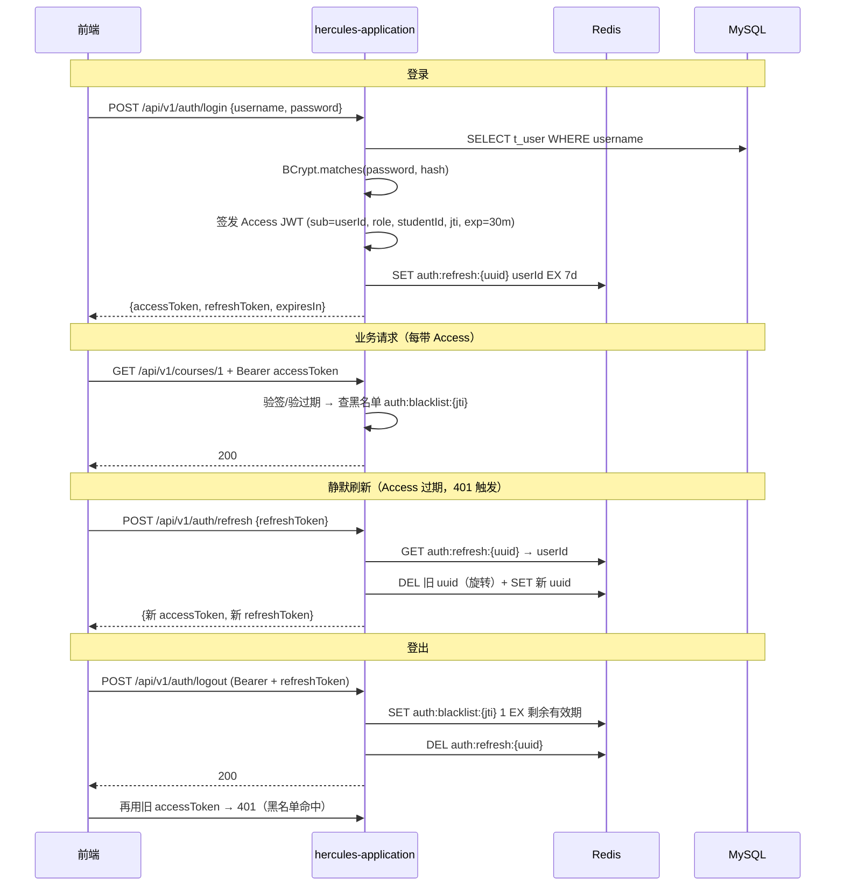
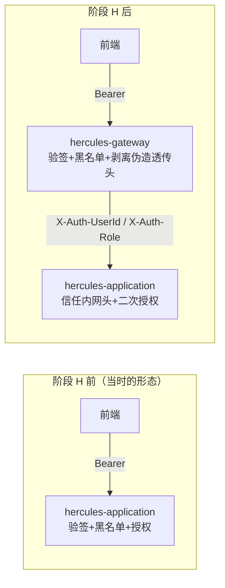
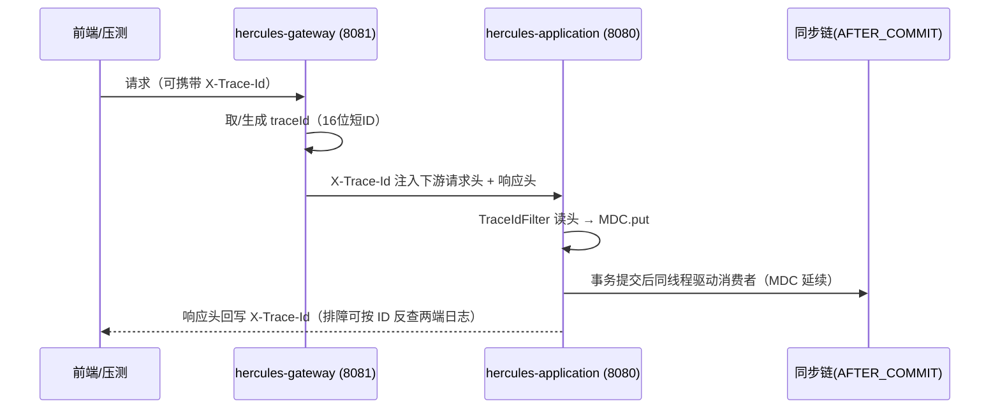
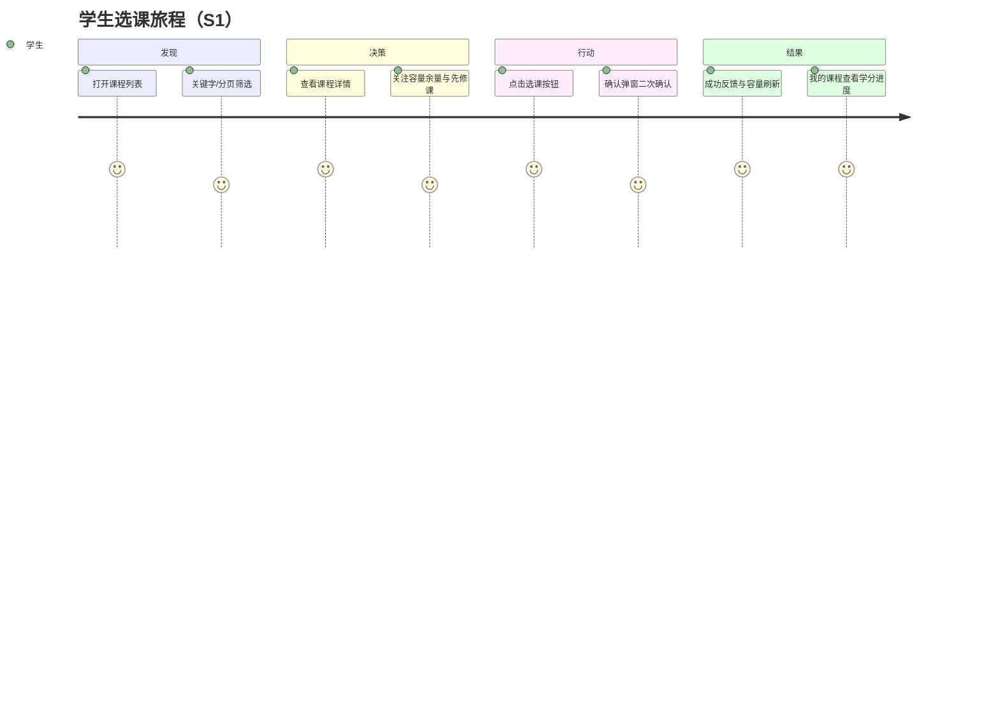
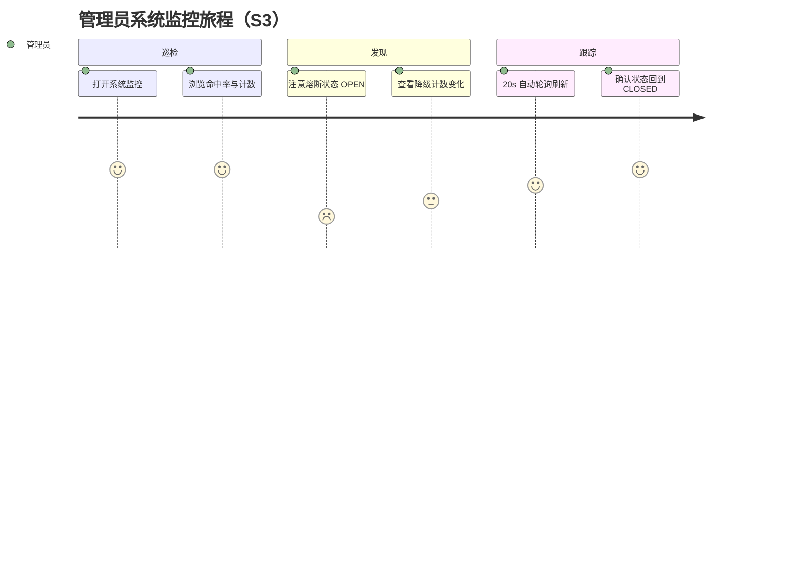
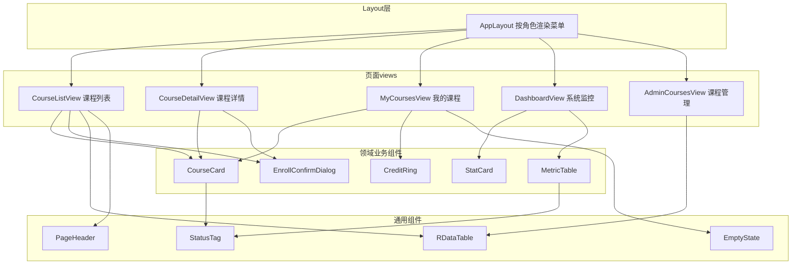
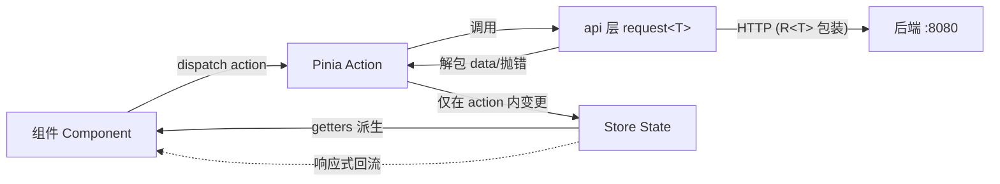

# 设计说明

这份文件写三块功能的设计取舍，以及与原设计不一致的地方。代码结构看《包结构说明.md》，需求做到哪一步看《路线图.md》。三部分依次是认证、日志、前端。

---

## 一、认证设计

> 定位：阶段 H 之前，认证在本应用内实现。网关落地后，验签与黑名单迁到 Gateway，应用内降级为「信任透传头 + 二次授权」。
> 落地状态（2026-09-10）：网关已上线，独立进程验签、注入透传头、剥离伪造头。应用内 JWT 过滤器保留，作为双层校验的第二层。黑名单仍在应用层，网关层查询待补（未实现）。前端（阶段 G）已按本契约实现：accessToken 只存内存；refreshToken 存 localStorage，静默续期；401 单飞刷新（同一时刻只发一次刷新请求），并发请求合并为一次。
> 角色：`STUDENT`（学生）与 `ADMIN`（管理/运维）。运维人员不单设角色，走 admin。

---

### 1.1 双 Token 机制

| Token | 形态 | 有效期 | 存放 | 用途 |
| :--- | :--- | :--- | :--- | :--- |
| Access Token | JWT（HS256，jjwt 0.13.0） | 30 分钟 | 前端 `api/tokenBox` 内存（不落 localStorage） | 业务接口 `Authorization: Bearer` |
| Refresh Token | UUID（无业务语义） | 7 天 | 服务端 Redis：`auth:refresh:{uuid}` → userId | 换新 Token 对（旋转式：换新即删旧） |

- Access 有效期只有 30 分钟，泄露风险可控。
- Refresh 存在服务端，可以随时强制失效。管理员踢人、用户改密都走这条路径。
- 旋转式刷新：refresh 用过一次就作废旧值，压缩重放窗口。

#### 时序图



#### Redis 键设计

| 键 | Value | TTL | 写入时机 |
| :--- | :--- | :--- | :--- |
| `auth:refresh:{uuid}` | userId | 7d | 登录 / 刷新（旋转时删旧立新） |
| `auth:blacklist:{jti}` | `1` | = Access 剩余有效期 | 登出 |

---

### 1.2 JWT 规范

- 密钥用配置项 `hercules.auth.secret`，写在 `application-local.yml` 里，该文件已 gitignore。HMAC-SHA256 要求密钥不少于 256 位，即 64 字符随机串；
- Payload：`sub`=userId、`username`、`role`、`studentId`（admin 为 null）、`jti`（本条 JWT 的唯一编号）、`iat`、`exp`。不允许存密码、手机号等敏感字段；
- 前端不解析 payload 的权限语义。权限以后端二次校验为准；
- 体积：payload 只有 4 个业务字段，远小于 8KB 上限。

---

### 1.3 用户表（新增，在历史基线归档的库表设计上增补）

```sql
CREATE TABLE IF NOT EXISTS t_user (
    id          BIGINT PRIMARY KEY AUTO_INCREMENT,
    username    VARCHAR(50)  NOT NULL,
    password    VARCHAR(60)  NOT NULL,          -- BCrypt（强度 10）
    role        VARCHAR(20)  NOT NULL,          -- STUDENT / ADMIN
    student_id  BIGINT,                         -- 学生业务号（选课用）；管理员为 NULL
    status      TINYINT      NOT NULL DEFAULT 1,-- 1 启用 0 停用
    create_time DATETIME(3)  NOT NULL,
    CONSTRAINT uk_user_username UNIQUE (username)
);
```

种子账号由 `AuthUserSeeder` 启动器幂等写入。BCrypt 密文在启动时现场生成，避免静态弱密文。账号：`admin/admin123`（ADMIN）；`st001~st003/123456`（STUDENT，student_id=20240001~03）。

#### 接口契约变更（水平越权收敛）

| 接口 | 变更前 | 变更后 |
| :--- | :--- | :--- |
| `POST /api/v1/enrollment` | body `{studentId, courseId}`（信任前端） | body `{courseId}`；studentId 取自 token（仅 STUDENT 角色） |
| `DELETE /api/v1/enrollment` | query `studentId&courseId` | query `courseId`；studentId 取自 token |
| `GET /api/v1/enrollment/mine` | — | 新增：查本人选课记录（S2 页面数据源） |

> 越权场景关闭：学生 A 无法操作学生 B 的数据。studentId 由服务端决定，不看前端传值。

---

### 1.4 应用内鉴权

网关上线后应用内这套仍然保留，作为第二层校验。

- Spring Security `SecurityFilterChain`：无状态，CSRF 关闭；
- 白名单（permitAll）：`/api/v1/auth/login`、`/api/v1/auth/refresh`、`/actuator/health`、`/actuator/prometheus`；
- `JwtAuthenticationFilter`（OncePerRequestFilter，每个请求只过一次）：解析 Bearer → 验签与过期 → 查黑名单 → 写 SecurityContext（userId/role/studentId）；
- 401/403 统一返回 `R.fail` JSON，由 `JsonUtil` 序列化。

URL 规则（按 `SecurityConfig.java` 里的顺序，先匹配到的先生效）：

| 路径 | 规则 | 说明 |
| :--- | :--- | :--- |
| 上面四条白名单 | 直接放行 | |
| `/api/v1/auth/logout` | 登录即可 | |
| `/api/v1/chat/**` | 登录即可 | 对话。真正执行选课时再校验是不是学生 |
| `/api/v1/enrollment/**` | 必须是学生 | |
| `/api/v1/cache/stats`、`/api/v1/debug/**` | 必须是管理员 | |
| `/actuator/**` | 必须是管理员 | 白名单里的 health 和 prometheus 除外 |
| `GET /api/v1/courses/**` | 登录即可 | |
| 其它所有请求 | 一律拒绝 | 默认拒绝，新增接口必须显式放行 |

Redis 故障策略（阶段 A+ 熔断模式的延续）：

| 依赖 | 故障时行为 | 理由 |
| :--- | :--- | :--- |
| 黑名单查询 | 短超时 + 放行 + 计数告警（fail-open，即故障时按通过处理） | 黑名单只影响「登出后的 token 被重放」这一低危场景，可用性优先 |
| Refresh 校验/写入 | fail-closed（故障时按不通过处理）：直接 401/500，提示重试或重新登录 | 刷新失败只影响续期，重新登录即可，不牺牲安全性 |
| 登出写黑名单失败 | 返回 500 让用户重试（不允许「登出失败但 token 继续有效」） | 安全性优先 |

---

### 1.5 两阶段迁移



迁移要点：
1. Gateway 全局过滤器接管：验签、过期、白名单（黑名单查询未实现，目前仍在应用层兜底）。校验通过后注入 `X-Auth-UserId` / `X-Auth-Role` 透传头（网关注入、供下游信任的请求头），并剥离客户端伪造的同名头（先 remove 后 inject，防越权经典漏洞）；
2. 应用内 `JwtAuthenticationFilter` 改为「透传头 → SecurityContext」的轻量过滤器，并对非网关来源的请求拒绝（网关到应用加共享密钥头校验）。当前应用内仍保留 JWT 验签过滤器，未做这一步替换（未实现）；
3. `JwtUtil` 下沉 hercules-common，网关与应用共用。签发仍只在登录接口。

---

### 1.6 前端衔接

- axios 请求拦截器：挂上 Access；
- 响应拦截器：401 → 用 refreshToken 静默刷新一次 → 重放原请求；刷新也失效 → 跳 `/login`；
- `authStore`：`accessToken` 只存在内存里，刷新页面就没了；`refreshToken` 存在 localStorage（键 `hercules.refresh`），7 天有效，服务端可以吊销。页面刷新后靠 401 静默刷新恢复会话；
- 接口契约变更同步：enroll 请求体收敛为 `{courseId}`，studentId 由服务端自取。

---

## 二、日志设计

> 定位：hercules-platform 全模块的日志规范与实现说明（阶段 A+ 日志设计落地）。
> 框架：SLF4J + Logback，Spring Boot 自带，没有新增依赖。

---

### 2.1 日志格式与文件布局

统一 pattern（应用侧，含 traceId）：

```
%d{yyyy-MM-dd HH:mm:ss.SSS} %-5level [%X{traceId:-}] [%thread] %logger{36} - %msg%n
```

| Appender | 文件 | 滚动策略 | 保留 | 特性 |
| :--- | :--- | :--- | :--- | :--- |
| CONSOLE | — | — | — | 显式声明 UTF-8，避免 Windows GBK 乱码 |
| APP_FILE | `logs/hercules-app.log` | 按天 + 100MB（SizeAndTimeBased） | 30 天 / 总量 2GB | 经 AsyncAppender（异步写盘，队列 4096、neverBlock），压测高并发时不阻塞业务线程 |
| AUTH_AUDIT_FILE | `logs/auth-audit.log` | 按天 | 90 天 | 认证审计专用（见 2.3），同步写，不丢失 |
| GATEWAY_FILE | `logs/hercules-gateway.log` | 按天 + 100MB | 30 天 / 1GB | 网关模块；WebFlux 没有 MDC（线程级日志上下文），traceId 写在消息体内 |

容器内路径 `/app/logs`，compose 挂载 named volume（`hercules-app-logs` / `hercules-gateway-logs`）持久化。本机直跑时用工程工作目录下的 `logs/`。

---

### 2.2 traceId 全链路贯通



- traceId 是一次请求的链路标识。缺失时自动生成，上游携带时复用。响应头回写，压测脚本可以记录 traceId 定位失败请求；
- 阶段 F 接入 micrometer-tracing 后由 OTel traceId 接管，`TraceIdFilter` 退化为兜底（未实现：代码里没有 OTel 相关依赖，目前只有 traceId 写进日志，没有 span，也没有调用耗时分解）；
- 网关侧（WebFlux/Reactor）没有 MDC 线程绑定语义，traceId 以显式参数和消息内嵌方式记录。

---

### 2.3 认证审计（AUTH_AUDIT）

专用 logger 名为 `AUTH_AUDIT`，`additivity=false`，独立落盘并同时输出到控制台。事件清单：

| 事件 | 级别 | 字段 | 触发点 |
| :--- | :--- | :--- | :--- |
| LOGIN_SUCCESS | INFO | username、ip、role、studentId | AuthController.login |
| LOGIN_FAILURE | WARN | username、ip、reason(BAD_CREDENTIALS/DISABLED) | AuthController.login（不含密码） |
| LOGOUT | INFO | username、ip、jti | AuthController.logout |
| LOGOUT_FAILED | WARN | username、ip、reason | 黑名单写入失败（fail-closed，返回 500 让用户重试） |
| TOKEN_REJECTED_BLACKLIST | WARN | jti、path | JwtAuthenticationFilter（已登出 token 被重放） |

客户端 IP：网关注入 `X-Client-IP`（原始 remote addr）。应用取该头，取不到时回退 `getRemoteAddr()`。

---

### 2.4 级别与前缀约定

| 级别 | 使用场景 |
| :--- | :--- |
| ERROR | 需要人工介入的异常，如同步链失败、未知异常，含堆栈 |
| WARN | 可自愈但需关注的异常，如降级、熔断、锁等待超时、登录失败 |
| INFO | 关键业务节点，如版本应用、审计事件、账号播种 |
| DEBUG | 键级留痕，如缓存失效、过期版本丢弃；默认关闭 |

日志前缀约定（`[hercules-cache]` / `[hercules-sync]` / `[hercules-auth]` / `[hercules-gateway]`），便于用 `grep` 快速过滤。

---

### 2.5 敏感信息规范（红线）

1. 密码：明文和密文都不落日志。BCrypt 比对失败只记用户名与 IP；
2. Token：accessToken、refreshToken、JWT 原文不落日志。jti 与 username 可以记；
3. secret：`hercules.auth.secret` 等配置项不落日志；
4. SQL 参数：生产和压测期不开 MyBatis 全参数 DEBUG；
5. 用户可读数据（课程名等）不受限。审计行保持结构化（`字段=值`），不要自由拼接。

---

### 2.6 压测与容器注意

- AsyncAppender `neverBlock=true`：队列满时丢弃并计数，优先保吞吐。日志量异常增长时配合 Grafana 与容器资源观测；
- 容器 stdout 由 docker 收集（`docker logs`）。落盘文件经 volume 持久化，两条通道互备；
- 排查动线：响应头 `X-Trace-Id` → `grep <traceId> hercules-app.log`（应用全链路）→ `grep <traceId> hercules-gateway.log`（入口层）。

---

## 三、前端设计

页面、路由、状态管理的实际结构见《包结构说明.md》第二节第 10 小节（hercules-ui），这里只记录设计取舍和与实现的偏差。

> 定位：`hercules-ui/` 的设计基线。状态：阶段 G 已落地（2026-09-10），本文档为设计记录。
> 与实现的偏差：Vite 5 换成 Vite 7；双 Layout 合并为单一 AppLayout，按角色渲染菜单；登录、JWT、401 静默刷新、SSE 对话（服务端推送的流式响应）都已接真实后端，原先标注「占位 / mock」的时点作废；新增对话助手页 `/student/chat`（阶段 D 贯通）。
> 形态：双端一壳 SPA（单页应用），学生端与管理端按角色切换。布局为左侧可折叠功能菜单加顶部栏（标题 + 用户下拉）。
> 技术栈：Vue 3.5 + Vite 7 + TypeScript + Pinia 3 + Vue Router 4 + Element Plus + ECharts。

---

### 3.1 设计原则

1. 场景驱动：页面与组件从用户旅程（S1-S4）反推，不做没有场景的功能；
2. 组件三级复用：Layout → 领域业务组件 → 通用 UI 组件。业务组件必须标注被哪些页面复用；
3. 严格单向数据流：Component →(dispatch)→ Store Action →(调用)→ api 层 → 后端 → Action 改 State → 响应式回流组件。组件禁止直接修改 store state；
4. 状态按领域分片：Pinia store 与后端领域一一对应（课程 / 选课 / 监控 / 认证 / 对话）。跨 store 依赖单向，enrollment → course；
5. API 层解包：后端统一 `R<T>` 包装在 `src/api/` 层解掉，store 与组件只见业务数据与错误。

---

### 3.2 场景驱动的用户旅程

#### S1 学生 · 浏览选课



#### S3 管理员 · 系统监控



#### 场景 × 页面 × 接口映射

| 场景 | 页面（路由） | 调用接口 |
| :--- | :--- | :--- |
| 登录（本期已可接真实接口） | `/login` | `POST /api/v1/auth/login`（返回 accessToken/refreshToken，存入 authStore） |
| S1 浏览选课 | `/student/courses`、`/student/courses/:id` | `GET /api/v1/courses`、`GET /api/v1/courses/{id}`、`POST /api/v1/enrollment`（body 仅 `{courseId}`，studentId 取自 token） |
| S2 退课/我的记录 | `/student/me` | `GET /api/v1/enrollment/mine`、`DELETE /api/v1/enrollment?courseId=` |
| S3 系统监控 | `/admin/dashboard` | `GET /api/v1/cache/stats`（每 20 秒轮询，ADMIN 角色） |
| S4 答辩演示 | 原来有 `/admin/demo` 页面，已移除 | `POST /api/v1/debug/simulate-conflict`、`POST /api/v1/debug/evict-local`，改为直接调接口 |

> 认证已落地（见 1.6 前端衔接）：所有请求带 `Authorization: Bearer <accessToken>`。401 刷新与刷新失败跳转的约定见同一节。

---

### 3.3 组件设计与复用

#### 组件依赖与复用关系



#### 复用矩阵

| 组件 | CourseListView | CourseDetailView | MyCoursesView | DashboardView | AdminCoursesView |
| :--- | :---: | :---: | :---: | :---: | :---: |
| CourseCard | 复用 | 复用 | 复用 | — | — |
| EnrollConfirmDialog | 复用 | 复用 | — | — | — |
| CreditRing | — | — | 复用 | — | — |
| StatCard | — | — | — | 复用×6 | — |
| MetricTable | — | — | — | 复用 | — |
| RDataTable | 复用 | — | — | — | 复用 |
| StatusTag | 复用（卡片） | 复用 | 复用 | — | 复用 |

关键复用点：
- `CourseCard` 一处实现、三处复用：列表模式（含选课按钮）、详情模式（含先修课与时间片）、我的课程模式（含退课按钮）。由 `mode` prop 切换；
- `EnrollConfirmDialog` 由「列表卡片」与「详情页」共同触发。内部封装容量余量校验文案，以及 409（容量已满）错误展示；
- `StatCard` 在驾驶舱六宫格复用，六格分别是命中率、各级命中、dbLoad、versionApplied、conflict、熔断状态。差异只有图标与 tooltip。

---

### 3.4 路由结构（Vue Router 4）

#### 守卫约定（`router.beforeEach`，已实现）

1. 未登录（authStore 没有角色，且内存里没有 accessToken）→ 重定向 `/login`，原地址放进 `redirect` 参数；
2. 已登录但角色不在 `meta.roles` 里 → 重定向到对应端的首页；
3. 前端按角色跳转只为了界面好用，权限以服务端为准（服务端会再判一次）。401 的处理见 1.6 前端衔接。

---

### 3.5 状态管理（Pinia · 按领域分片 + 单向数据流）

令牌不放在 store 里，放在 `api/tokenBox`。两枚令牌的存放位置与静默续期流程见 1.6 前端衔接。

#### 单向数据流



单向数据流五条铁律（代码评审依据）：
1. 组件只读 state 与 getters，写操作一律走 `store.action()`；
2. HTTP 调用只允许出现在 `src/api/*`，且只由 action 调用。组件禁止直连 api；
3. `R<T>` 解包发生在 api 层：`code !== 0` 抛 `ApiError`，store 只处理业务数据；
4. 跨 store 依赖单向：`enrollment → course`（选课后刷新容量）。禁止反向或成环；
5. 组件本地 UI 状态（弹窗开关等）放组件内，不进 store。

---

### 3.6 API 层约定

#### api 层约定

- `src/api/course.ts / enrollment.ts / monitor.ts / auth.ts` 按领域分文件；
- 统一 `request<T>(config): Promise<T>`：axios 封装，负责解包 `R<T>`、401/409/404 错误映射（`ElMessage` 提示 + 抛 `ApiError`）、20s 超时；
- 类型集中在 `src/types/`，与后端字段一一对应：`Course`、`Enrollment`、`PageResult<T>`、`CacheStats`。

---

### 3.7 实施边界

| 范围 | 内容 | 时点 |
| :--- | :--- | :--- |
| 本期（已落地） | S1-S4 全部页面 + 对话助手（阶段 D 已接 SSE 真实实现，含候选卡确认按钮与停止生成） | 已完成 |
| 认证（已落地） | `/login` 接 JWT、守卫角色预判、401 单飞静默刷新、失效跳登录 | 已完成 |
| 后续可选 | 会话历史 Redis 持久化、移动端适配、Playwright E2E、暗色主题 | 未实现（未排期） |
